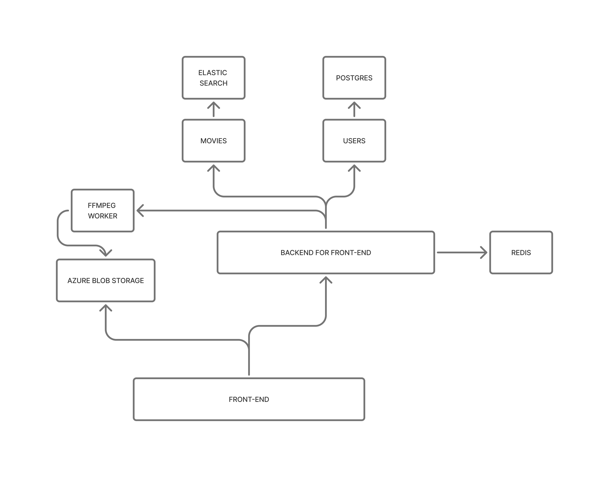

# Rusty streamer

```bash
openapi-generator-cli generate -g rust --additional-properties=library=reqwest,supportAsync=true -i ../../api-docs/openapi.json --skip-validate-spec
```

# Architecture overview
